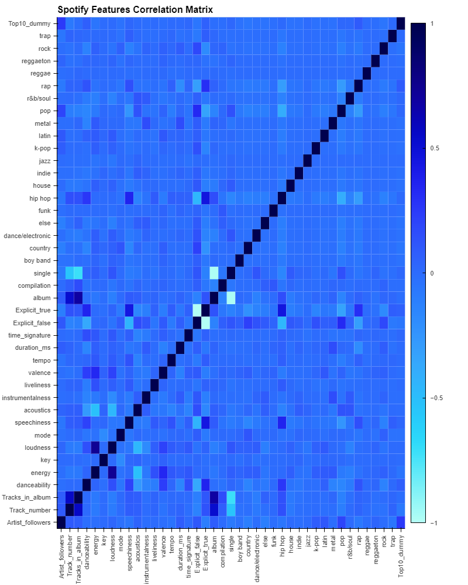

# Project 2: Spotify Popularity Predictor

Code developed by Andrew Bader, Trent Ransom, Halam Kim, and Max Accurso

## Table of Contents
 1. [Installation Instructions](#Installation)
 2. [Introduction](#Introduction)
 3. [Artist Recruitment](#Recruitment)
 4. [Shift to Data Driven Decisions](#Shift)
 5. [Investment in New Talent](#Investment)
 6. [Our Product](#Product)
 7. [Project Operations](#Operations)
    - a. [Data Collection and Cleanup](#Data)
    - b. [Models](#Models)
    - c. [API](#API)
    - d. [Visualizations](#Visualizations)
    - e. [Data Sources](#Sources)

## 1. Installation Instructions <a name="Installation"></a>
To clone and use:
1) make a local directory for this github repository
2) clone down this repo with git clone command
3) cd into cloned repo
4) activate conda development environment
5) install necessary dependencies via the following commands:
    ```
    pip install pandas
    pip install numpy
    pip install pathlib
    pip install -U scikit-learn
    pip install spotipy 
    ```
6) get your spotify api keys from the [spotify developer dashboard](https://developer.spotify.com/dashboard)
7) add your keys to a file named .env in the root directory formatted as:
    ```
    cid = 'client id'
    secret = 'secret key'
    ```
8) open final_compiled_notebook.ipynb Jupyter Notebook
9) run the file
10) choose song of interest in code block 31 and run blocks 31, 32, 33 for a prediction if in top 50 or not

## 2. Introduction <a name="Introduction"></a>

In the 20th century, record labels played a dominant role in shaping the careers of successful artists. However, in our generation, the music industry has evolved to the point where a growing number of artists have achieved success without signing to a label. Furthermore, the definition of success in the industry has broadened due to the emergence of multiple income streams. While it is not necessary for an artist to sign with a label, it is important to note that record labels have long been a major contributor to the US economy. They have traditionally collected the majority of music industry revenues, and therefore their impact on the economy should not be overlooked.

## 3. Artist Recruitment <a name="Recruitment"></a>

The role of A&R (short for artist and repertoire) in the music industry is often misunderstood and misconstrued. While the term has become a catch-all phrase for anything related to music curation and discovery, the A&R's specific responsibility is to oversee the artist's entire journey - from talent discovery and signing, to music creation, marketing, and promotion. A&R tasks can include identifying new talent for a record label, arranging recording sessions, and serving as a liaison between artists, producers, and other creatives. 

As technological advancements have continued to transform the music industry, the A&R role has also evolved. With social media platforms like TikTok and Twitter, any artist can now go viral without the help of a record label or marketing team. Consequently, the A&R role has also changed, as data and analytics have become valuable tools to identify the next big artist. 

The A&R serves as the link between the artist and the audience, often acting as a visionary with a keen ear for talent. A good A&R should be able to spot an artist with star power and help them reach their full potential. They may provide input on aspects such as song structure and beat selection while building connections to ensure an artist's success. 

When considering new talent, the A&R may also look to metrics such as streaming and social media numbers to back up their instincts. While an artist may sound impressive, their play counts and project popularity can give insight into their potential commercial success.

## 4. Shift to Data Driven Decisions <a name="Shift"></a>

From the beginning of music data analytics, professionals have been striving to create a model that accurately predicts an artist's career trajectory. However, despite efforts, such a model has not been achieved, and success is often determined by a self-fulfilling prophecy of the right team and budget. 

Nevertheless, A&R has become one of the most data-driven positions in the music industry, given the vast ocean of newly released music. With the sheer volume of music produced, every A&R needs some automated tool to filter through it. Thus, modern A&R departments rely on analytics, which could range from AI-driven solutions and conventional analytics dashboards to in-house analytics. 

While different labels and distributors have varying criteria for signing new talent, A&Rs have to rely on their judgment rather than blindly following data algorithms. However, the best way to ensure signing the best talent is to make sure an artist appears on their A&R data radar first. In the late 2010s, key players raced to set up their analytic pipelines, while the 2020s will focus on fueling these pipelines with data no one else has. 

Most A&R data development strategies today aim to get access to consumption datasets on top of public-API data for a better view of artists' performance. Artist data can be categorized into three types based on its source: Open-API & Crawled Data, Streaming Consumption Data, and First-party Analytics. The first category provides high-level metrics, such as following across platforms and monthly listeners, while the second includes more granular data, such as stream counts and listener location. The third category provides the most detailed data, such as audience demographics and engagement metrics.

## 5. Investment in New Talent <a name="Investment"></a>

Music production and distribution have become more accessible than ever, with many artists recording and producing songs in their home studios and distributing their music on streaming platforms with just a few clicks. With over 12 million creators publishing music worldwide, A&R departments responsible for discovering and signing new artists face an overwhelming number of artists to evaluate. They must assess each artist's ability to engage and retain audiences over the long term. On average, record labels invest over $4 billion annually in A&R alone, which accounts for 33.8% of their revenues. Upon signing a new artist, a label typically invests anywhere from $500,000 to $2,000,000 in various services, including an advance, recording, video production, tour support, marketing, and promotion. Here is a typical breakdown of the funds allocated to a single artist signing:

- Advance: $50,000 - $350,000
- Recording: $150,000 - $500,000
- Video Production: $50,000 - $300,000
- Tour Support: $50,000 - $150,000
- Marketing & Promotion: $200,000 - $700,000

Labels are more focused on the business side of music and less involved in the creative process, which is the artist's responsibility. They understand the importance of allowing artists to work on their music and are willing to invest significant capital in new talent to provide them with the freedom to grow and evolve as musicians. 

## 6. Our Product <a name="Product"></a>

Our product leverages structured data to provide a cutting-edge visualization of an artist's potential. By accurately predicting a song's likelihood to break into the top 50 hits in the USA with 75% accuracy, our model aims to be the first to discover the next big thing in music. 

Our team recognizes the significance of signing artists, given the substantial amount of capital that labels must deploy and the considerable time and effort involved in the process. We strive to assist A&R departments by efficiently sorting through millions of up-and-coming artists and projecting the musician's potential success accurately. By achieving these objectives, our model mitigates the risk taken on by labels and ensures a calculated risk that will pay off in the long run.

## 7. Project Operations <a name="Operations"></a>

### a. Data Collection and Cleanup <a name="Data"></a>

We extracted Spotify data from the Spotify HUGE database, which consists of daily charts spanning over three years, from https://www.kaggle.com/datasets/pepepython/spotify-huge-database-daily-charts-over-3-years. To ensure the reliability of our analysis, we chose the US data as it contained the most complete and non-null fields. We dropped columns that were not from the original Spotify API, as they were redundant and contained null values. We also converted certain string type columns to float type using for loop and astype algorithms. During the analysis, we observed oversampling issues when comparing top 10 and top 50 counts, which was expected due to the higher number of non-top songs. To address this issue, we implemented random oversampling methods to better balance the counts between the two categories. We also applied scaling methods to account for the significant variation in feature scales. In addition, we experimented with data trimming methods to extract interquartile range data and exclude outliers for top 10 data (as seen in top-10_data-trimming-resampling-work.ipynb). After cleaning and scaling the data, we saved it as a CSV file and used it to develop predictive models through machine learning algorithms.

### b. Models <a name="Models"></a>

We built our final model using an **ensemble** approach. We began by testing several different models. The models we tested were:

- Support Vector Classifier
- Decision Tree Classifier
- Logistic Regression
- Random Forest Classifier
- K Nearest Neighbors Classifier
- Adaptive Boosting Classifier
- Gradient Boosting Classifier
 
In our final model we wanted high accuracy with consistent performance across the unpopular and the hit songs. We chose the five best performing models to ensemble together to create our final model. The ensemble model is a voting classifier with each voter getting equal weight. The models we ensembled together for the Voting Classifier are SVM, Decision Tree, Random Forest, AdaBoost, and Gradient Boost. Three of these are more advanced ensemble models. AdaBoost and Gradient Boost take different approaches to force the model to focus more on the instances that are difficult to classify. Random Forest is an ensemble of Decision Tree models that work on different parts of the data. Looking at the weights of the features we found that Artist followers was the most influential column. After that, danceability, tempo, and duration are the most important features in the success of the song.

### c. API <a name="API"></a>

We used the *spotipy* module in python to interact with the Spotify api. 

We created our own module, implemented in the final notebook, which will gather data about the song that we enter in the search and format that data to match our original dataframe. This way we can run that song through the model to test it on newer songs. 

If you'd like to test with different songs, you only need to change the **"song"** variable. Enter any song/artist, and it'll grab the data using Spotify API. 

**Note** : The dataset is based on song charts 2017-2020, and therefore the model works best with song trends from this time period. 

### d. Visualizations <a name="Visualizations"></a>

To explore various feature aspects of the dataset, we employed a range of visualization techniques. Using hvplot, we compared different features between the top50 and non-top50 categories. For instance, we found a correlation between an increase in artist followers and an increase in the top50 count, which served as a positive control for our analysis. We also discovered some intriguing trends, such as a slight correlation between higher danceability and songs in the top50 category, while longer songs seemed to be represented at a slightly lower frequency. Additionally, songs with more energy seemed to be less represented in the top50 category. We further generated a correlation matrix heatmap through hvplot, revealing interesting trends between features of interest in the Spotify dataset. For example, boy-band songs were slightly negatively associated with danceability, while country music was positively correlated with non-explicit music. The heatmap also showed that loudness was negatively correlated with acoustics, among many other noteworthy correlation trends.

Below, you will find box plots displaying the most important features stated above and the correlation matrix heatmap. 


<p>&nbsp;</p>
<p>&nbsp;</p>


<p>&nbsp;</p>
<p>&nbsp;</p>


<p>&nbsp;</p>
<p>&nbsp;</p>


<p>&nbsp;</p>
<p>&nbsp;</p>


<p>&nbsp;</p>
<p>&nbsp;</p>

### e. Data Sources <a name="Sources"></a>

1. Kaggle Dataset (https://www.kaggle.com/datasets/pepepython/spotify-huge-database-daily-charts-over-3-years)
2. Spotify API (https://developer.spotify.com/documentation/web-api)
3. IFPI Music Ecosystem (https://powering-the-music-ecosystem.ifpi.org/)
4. Record Label and A&R Info (https://smartistu.com/all-you-need-to-know-about-record-label-ar/)
